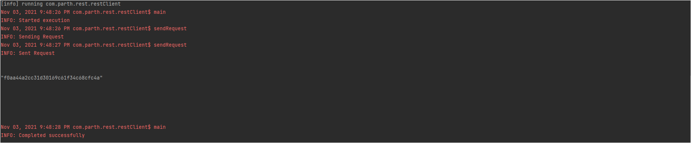
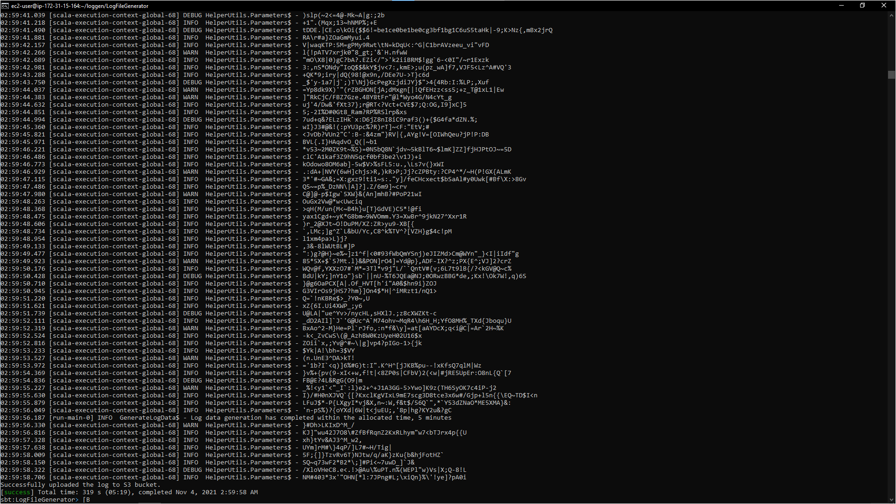
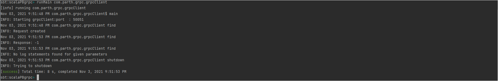
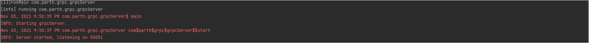

# Homework 3

## Information
| Object | Value |
| :---: | :---: |
|Name | Parth Deshpande|
| UIN | 657711378 |
| Email | [pdeshp8@uic.edu](mailto:pdeshp8@uic.edu)
| YouTube Link (Project Walk-through) | [YouTube](https://www.youtube.com/watch?v=t0WFmacnK9g)

## Explanation
The project can be subdivided into two tasks.
1. Deployed a local gRPC client and server where the server calls a lambda function on AWS to check [task 1.](#task-1)
2. Created a REST client using [AKKA](https://akka.io/) which calls a GET method in turn invoking a lambda function via Amazon API which performs [task 2](#task-2)

## Tasks
### Task 1
To check if the logs contain messages in a specific range determined by the inputs to the task, including a timestamp < hh:mm:ss.SSS > and a time range < ss > which represents the time interval (t - dt : t + dt).
### Task 2
To return a MD5 Hash of a concatenated string which is formed by extracting all the messages in the time interval specified as in [task 1](#task-1) which match a predefined regex pattern which can be set as an input to the Lambda function.

## Important Files
### [gRPC](src/main/scala/com/parth/grpc)
Name | Description |
| :---: | :---: |
| [awsCaller](src/main/scala/com/parth/grpc/awsCaller.scala) | A caller function which uses AKKA's Actor system to perform [task 1](#task-1) to call the lambda function and get a result back using RESTful service GET |
| [grpcClient](src/main/scala/com/parth/grpc/grpcClient.scala) | The local client which will invoke the [grpcServer](src/main/scala/com/parth/grpc/grpcServer.scala) using function(s) defined in [log.proto](src/main/protobuf/log.proto).  |
| [grpcServer](src/main/scala/com/parth/grpc/grpcServer.scala) | The local server which listens for calls by the client to invoke a GET call to the AWS Lambda using [awsCaller](src/main/scala/com/parth/grpc/awsCaller.scala) |
| [log.proto](src/main/protobuf/log.proto) | A [ScalaPB](https://scalapb.github.io/) protocol buffer file which holds the method(s) to be used for intercommunication between [grpcClient](src/main/scala/com/parth/grpc/grpcClient.scala) and [grpcServer](src/main/scala/com/parth/grpc/grpcServer.scala)  |

### [REST](src/main/scala/com/parth/rest)
Name | Description |
| :---: | :---: |
| [restClient](src/main/scala/com/parth/rest/restClient.scala) | A class to invoke the AWS Lambda function using Amazon API RESTful service which uses AKKA's actor system to implement the functionality |

### [Config](src/main)
Name | Description |
| :---: | :---: |
| [application.conf](src/main/resources/application.conf) | Includes parameters used while executing classes |

### [Test](src/test/scala/com/parth/grpc)
Name | Description |
| :---: | :---: |
| [configTest.scala](src/test/scala/com/parth/grpc/configTest.scala) | ScalaTest class using [AnyFlatSpec](https://www.scalatest.org/scaladoc/3.2.9/org/scalatest/flatspec/AnyFlatSpec.html) with [Matchers](https://www.scalatest.org/user_guide/using_matchers) to perform various tests on the parameters saved in the [application.conf](src/main/resources/application.conf) file |

## Instructions
1. Clone the project using `git clone https://github.com/parth-d/scalaPBgrpc`
2. Execute `sbt clean compile`
### 1. REST
3. Enter the sbt shell using `sbt`
4. Execute `runMain com.parth.rest.restClient`
### Part 2 (gRPC)
3. Open 2 terminal windows
4. Start the server on one terminal
   1. On the terminal, execute `runMain com.parth.grpc.grpcServer`
5. Start the client on one terminal
   1. On the terminal, execute `runMain com.parth.grpc.grpcClient`
   2. Wait for the results

### Part 3 (AWS: LogGen)
1. Start an EC2 instance and SSH into it.
2. Clone the project `git clone https://github.com/parth-d/LogFileGenerator`.
3. Execute `sbt run` in the root directory of the cloned project.

## Default Results
### 1. REST Client

### 2. Log Generator

### 3. gRPC Client

### 4. gRPC Server

## References
1. [ScalaPB gRPC](https://scalapb.github.io/docs/grpc)
2. [AKKA GET Request (HTTP)](https://github.com/akka/akka-http/blob/v10.2.6/docs/src/main/paradox/client-side/request-level.md)
3. [gRPC Client Server Setup](https://github.com/xuwei-k/grpc-scala-sample)